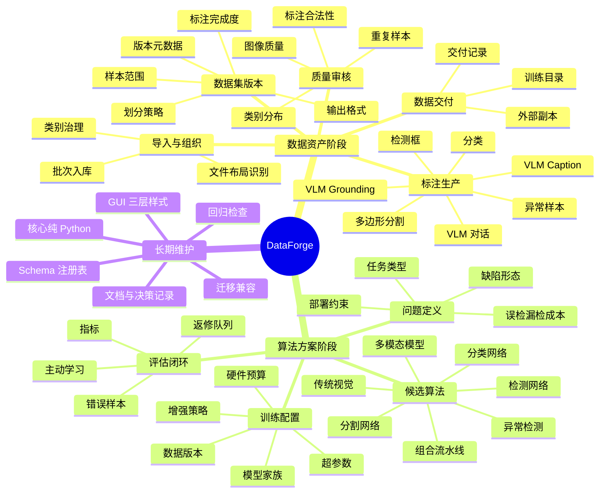

# 数据坊长期路线图与思维导图

这份文档用于约束后续阶段性工作。阶段性不是“做完一个页面”，而是每一阶段都交付一个可验证的业务能力，并且为下一阶段留下稳定接口、数据资产和评估标准。

## 北极星

数据坊的长期目标不是只做标注工具，也不是只做大模型数据工具，而是成为视觉算法落地前的数据与实验资产平台：

1. 数据进入项目后，能被组织、标注、审核、版本化和追溯。
2. 数据版本能支撑不同算法路线，不被单一格式或单一模型绑定。
3. 算法选择基于问题、数据、指标、成本和部署约束，而不是先假设一定使用大模型。
4. 训练、评估、错误分析和返工能闭环回数据侧。

## 思维导图

## 阶段定义

### 阶段 1：数据资产打底

目标是让用户不再只“看见一堆图片”，而是看见一个可管理的数据资产。

交付能力：

- 数据导入有批次、类别、原始路径和入库记录。
- 标注页按目标格式判断完成/未完成，但目标格式仍是具体格式，例如 YOLO、COCO、VOC、LabelMe、LLaVA、ShareGPT、Swift、JSONL。
- 审核页能把质量问题和重复样本变成可处理队列。
- 数据集版本冻结样本范围、划分、格式和元数据，不直接承担画框、分割或 VLM 字段这类工作方式选择。
- 交付页只交付已冻结或明确配置的输出，不混淆源标注格式、目标训练格式和临时预设。

验收标准：

- 任意项目都能回答：当前数据多少张、多少类、哪些完成、哪些未完成、为什么未完成。
- 任意版本都能回答：用哪些样本、按什么比例划分、导出什么格式、什么时候生成。
- 任意返工都能回到具体图片、具体问题、具体标注字段。

### 阶段 2：算法方案中心

目标是从“我有什么数据”进入“我应该用什么算法解决业务问题”。

这里不应该默认大模型。算法路线应按场景选择：

| 场景 | 优先考虑 | 典型算法 |
|---|---|---|
| 缺陷外观稳定、规则明确 | 传统视觉或轻量分类 | 阈值、形态学、模板匹配、SVM、Random Forest |
| 正常样本多、缺陷样本少 | 异常检测 | PatchCore、PaDiM、STFPM、DRAEM |
| 缺陷目标位置重要 | 目标检测 | YOLO、RT-DETR、Faster R-CNN |
| 缺陷边界和面积重要 | 分割 | U-Net、DeepLab、Mask R-CNN、SAM 辅助标注 |
| 只需判定类别或状态 | 分类 | ResNet、EfficientNet、ConvNeXt、ViT |
| 需要图文解释、区域描述、复杂问答 | 多模态模型 | LLaVA、Qwen-VL、InternVL、ShareGPT/Swift 数据 |
| 现场约束复杂 | 组合流水线 | 传统视觉预筛 + 检测/分割 + 规则后处理 |

交付能力：

- 新增“算法方案”视角：绑定一个数据集版本，记录候选算法、指标、约束和训练配置。
- 支持多条路线并行比较，而不是一个项目只有一个模型方向。
- 每次训练/评估都产生实验记录：数据版本、算法、参数、指标、错误样本。
- 错误样本能回流到审核和标注阶段，形成主动学习闭环。

验收标准：

- 用户能从数据版本创建算法方案。
- 用户能解释为什么选某类算法，而不是只看到一个模型下拉框。
- 失败实验能沉淀为数据返工任务，而不是只留下一个低指标数字。

### 阶段 3：实验与模型资产

目标是把算法方案从一次性脚本变成可比较、可复现的资产。

交付能力：

- 实验记录：模型、数据版本、训练参数、指标、耗时、硬件环境。
- 模型注册：best、candidate、deprecated 状态。
- 指标面板：分类准确率、检测 mAP、分割 IoU、异常检测 AUROC/F1、业务阈值。
- 错误分析：按类别、尺寸、光照、相似缺陷、漏检/误检聚合。

验收标准：

- 同一数据版本可以比较多种算法。
- 同一算法可以比较多个数据版本。
- 模型好坏能追溯到数据和配置，不靠口头经验。

### 阶段 4：部署与持续反馈

目标是让模型上线后的问题能回到数据坊，而不是脱离数据闭环。

交付能力：

- 推理结果导入：把线上误检、漏检、低置信度样本导回项目。
- 数据漂移检查：新数据和训练版本的分布差异。
- 人工复核队列：线上问题转成标注/审核任务。
- 再训练建议：当错误样本积累到阈值时提示生成新版本。

验收标准：

- 线上问题能定位到图片、模型、版本和错误类型。
- 新一轮数据版本能明确吸收了哪些反馈样本。

## 当前阶段的产品边界

近期应聚焦阶段 1 和阶段 2 的接口，不要急着把训练平台做大。

优先级：

1. 先把数据页、标注页、审核页、数据集版本页、交付页的概念统一。
2. 再增加“算法方案”入口，但第一版只做方案记录和数据版本绑定。
3. 训练执行可以先留接口，不急于内置所有训练框架。
4. 大模型只是算法路线之一，VLM 数据能力要放在算法方案体系内，而不是独立成一个误导性的主流程。

## 维护规则

- `core/` 继续保持纯 Python，数据版本、算法方案、实验记录都先放 core 模型和存储层。
- GUI 只负责呈现和编排，不直接写算法业务逻辑。
- 每新增一个阶段页，都要明确它读什么、写什么、是否修改原项目。
- 每新增一个格式或算法，必须先定义 schema、完成度判断、导出/评估边界。
- 每次大改 UI 信息架构，都同步更新本文件和 README 的阶段说明。
